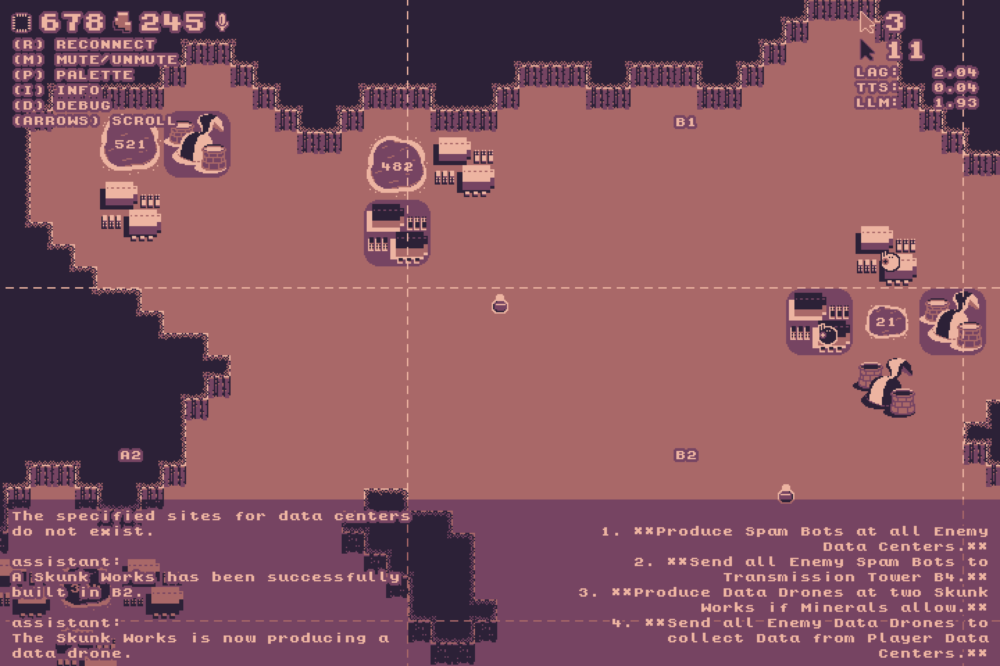

# data-wars

The original Game Design Document can be found here: https://docs.google.com/document/d/1yl881vF5pbjIZUkDfpRuRqzYvci9hVO1G3AjP7fEMJc

This was made for Deepgram's GramJam 2026 hackathon, and has a corresponding DevPost link here: https://devpost.team/deepgram/projects/14276

And the game is hosted here (possibly with the password `data-wars`): https://vacuumbrewstudios.itch.io/data-wars



## Twilio Easter Egg

I also made "Meta Strike" - a little Twilio integration service coded up here: https://github.com/nikolawhallon/meta-strike

It runs at wss://data-wars.deepgram.com and allows you to call +1(734)802-2990 at any time to order a Strike.
During a Strike, all units and buildings in the game, on both Teams, get destroyed, and everyone has to effectively
start over again.

## Linux Builds

The damn Linux export templates for Godot 4.6 seem to have some microphone bug. But the following got builds working:
```
cp /run/current-system/sw/bin/godot4.6 data-wars.x86_64
chmod u+w data-wars.x86_64
cat data-wars.pck >> data-wars.x86_64
chmod +x data-wars.x86_64
```

## Web Builds

I made this game with the latest (at the time) Godot 4.6 - unfortunately, a lot of previous nice Web compatibility
stuff seems to have been totally broken in this version over 4.2 or 3.x. I went through the following JS/HTML
hacks to get things back working again.

The general idea is to pass Deepgram audio directly to the browser to playback (by-passing Godot entirely),
and to pass microphone audio directly to Deepgram via the browser (by-passing Godot entirely). We also
hack back in authentication. Otherwise, text messages to and from Deepgram and Godot still function.

### Auth Only

In Web builds, in `index.js`, replace:
```javascript
{if(protos){socket=new WebSocket(url,protos.split(","))}else{socket=new WebSocket(url)}}
```
with:
```javascript
{if(protos){socket=new WebSocket(url,protos.split(","))}else if(url.startsWith("wss://agent.deepgram.com")){socket=new WebSocket(url,["token","DEEPGRAM_API_KEY"])}else{socket=new WebSocket(url)}}
```
in order to restore the use of protocols for Godot games that use WebSockets in-browser.

### Full Recipe

In addition to adding auth back, I needed to handle all audio in and out of Deepgram directly
via the browser, not the Godot engine, for maximal performance. This also meant handling
microphone "muting" via the browser, and a few other tricks. The following is the recipe I used.

In Web builds, in `index.js`, replace:
```javascriptlet socket=null;try
let socket=null;try{if(protos){socket=new WebSocket(url,protos.split(","))}else{socket=new WebSocket(url)}}catch(e){return 0}socket.binaryType="arraybuffer";return GodotWebSocket.create(socket,on_open,on_message,on_error,on_close)
```

with:
```javascript
let socket = null;

try {
  const parsedUrl = new URL(url, window.location.href);
  const tag = parsedUrl.searchParams.get("tag");
  const isDeepgram = url.startsWith("wss://agent.deepgram.com");
  const isPlayer = isDeepgram && tag === "player";

  if (protos) {
    socket = new WebSocket(url, protos.split(","));

  } else if (isDeepgram) {
    socket = new WebSocket(url, ["token", "DEEPGRAM_API_KEY"]);

    if (isPlayer) {
      if (window.DeepgramMic) {
        window.DeepgramMic.ws = socket;
        socket.addEventListener("open", () => {
          window.DeepgramMic.start().catch(console.error);
        });
      }

      // Deepgram-specific handlers: text -> Godot, binary -> JS only
      socket.onopen = (ev) => on_open(ev);
      socket.onerror = (ev) => on_error(ev);
      socket.onclose = (ev) => on_close(ev);

      socket.onmessage = (event) => {
        if (typeof event.data === "string") {
          try {
            const msg = JSON.parse(event.data);
            if (msg && msg.type === "UserStartedSpeaking") {
              if (window.DeepgramTTS && window.DeepgramTTS.reset) {
                window.DeepgramTTS.reset();
              }
            }
          } catch (e) {
            // ignore
          }

          const enc = new TextEncoder("utf-8");
          const buffer = new Uint8Array(enc.encode(event.data));
          const len = buffer.length;
          const out = GodotRuntime.malloc(len);

          HEAPU8.set(buffer, out);
          on_message(out, len, 1);
          GodotRuntime.free(out);

        } else {
          if (window.DeepgramTTS) {
            if (event.data instanceof ArrayBuffer) {
              window.DeepgramTTS.enqueue(event.data);
            } else if (event.data instanceof Blob) {
              event.data.arrayBuffer().then(buf => window.DeepgramTTS.enqueue(buf));
            }
          }
        }
      };

      socket.binaryType = "arraybuffer";
      return IDHandler.add(socket);
    }

  } else {
    socket = new WebSocket(url);
  }

} catch (e) {
  return 0;
}

socket.binaryType = "arraybuffer";
return GodotWebSocket.create(socket, on_open, on_message, on_error, on_close)
```

Replace `DEEPGRAM_API_KEY` above with your actual Deepgram API key.

Next, in `index.html`, insert the following block **before**:
```html
<script src="index.js"></script>
```

```html
<script>
window.addEventListener("pointerdown", async () => {
  try {
    if (window.DeepgramMic && window.DeepgramMic.ctx && window.DeepgramMic.ctx.state !== "running") {
      await window.DeepgramMic.ctx.resume();
      console.log("Resumed DeepgramMic AudioContext");
    }
    if (window.DeepgramTTS && window.DeepgramTTS.ctx && window.DeepgramTTS.ctx.state !== "running") {
      await window.DeepgramTTS.ctx.resume();
      console.log("Resumed DeepgramTTS AudioContext");
    }
  } catch (e) {
    console.error("AudioContext resume failed:", e);
  }
}, { once: false });
</script>

<!-- Deepgram Mic helper -->
<script>
window.DeepgramMic = {
  ctx: null,
  source: null,
  processor: null,
  ws: null,
  muted: false,

  toggleMute() {
    this.muted = !this.muted;
    console.log("Mic muted:", this.muted);
  },

  async start() {
    if (this.processor) return;

    if (!navigator.mediaDevices || !navigator.mediaDevices.getUserMedia) {
      console.error("getUserMedia not available");
      return;
    }

    const stream = await navigator.mediaDevices.getUserMedia({ audio: true });

    const Ctx = window.AudioContext || window.webkitAudioContext;
    const ctx = new Ctx();
    this.ctx = ctx;

    await ctx.resume().catch(console.error);
    console.log("Mic ctx state:", ctx.state);

    const source = ctx.createMediaStreamSource(stream);
    this.source = source;

    const bufferSize = 2048;
    const processor = ctx.createScriptProcessor(bufferSize, 1, 1);
    this.processor = processor;

    processor.onaudioprocess = (event) => {
      if (!this.ws || this.ws.readyState !== WebSocket.OPEN) return;

      const input = event.inputBuffer.getChannelData(0);
      const len = input.length;
      const pcm16 = new Int16Array(len);

      for (let i = 0; i < len; i++) {
        let s = this.muted ? 0 : input[i];
        s = Math.max(-1, Math.min(1, s));
        pcm16[i] = s < 0 ? s * 0x8000 : s * 0x7fff;
      }

      this.ws.send(pcm16.buffer);
    };

    // Chrome needs the processor connected to a live graph
    const muteGain = ctx.createGain();
    muteGain.gain.value = 0;

    source.connect(processor);
    processor.connect(muteGain);
    muteGain.connect(ctx.destination);
  },

  stop() {
    if (!this.processor) return;

    this.source && this.source.disconnect();
    this.processor.disconnect();
    this.processor.onaudioprocess = null;
    this.processor = null;
  }
};

window.addEventListener("keydown", (e) => {
  if (e.repeat) return;
  if (e.key === "m" || e.key === "M") {
    if (window.DeepgramMic) {
      window.DeepgramMic.toggleMute();
    }
  }
});
</script>

<!-- Deepgram TTS helper -->
<script>
window.DeepgramTTS = {
  ctx: null,
  nextTime: 0,
  started: false,
  activeSources: new Set(),
  generation: 0,

  _ensureCtx() {
    if (this.ctx) return;

    const Ctx = window.AudioContext || window.webkitAudioContext;
    this.ctx = new Ctx();
  },

  async enqueue(arrayBuffer) {
    this._ensureCtx();

    if (this.ctx.state !== "running") {
      await this.ctx.resume().catch(console.error);
    }

    console.log("TTS ctx state:", this.ctx.state);

    const myGeneration = this.generation;

    const pcm16 = new Int16Array(arrayBuffer);
    const len = pcm16.length;

    const audioBuffer = this.ctx.createBuffer(1, len, this.ctx.sampleRate);
    const ch = audioBuffer.getChannelData(0);

    for (let i = 0; i < len; i++) {
      ch[i] = pcm16[i] / 32768;
    }

    const src = this.ctx.createBufferSource();
    src.buffer = audioBuffer;
    src.connect(this.ctx.destination);

    const now = this.ctx.currentTime;

    if (!this.started || this.nextTime < now + 0.03) {
      this.nextTime = now + 0.03;
      this.started = true;
    }

    this.activeSources.add(src);

    src.onended = () => {
      this.activeSources.delete(src);
    };

    if (myGeneration !== this.generation) {
      try { src.disconnect(); } catch (_) {}
      this.activeSources.delete(src);
      return;
    }

    src.start(this.nextTime);
    this.nextTime += audioBuffer.duration;
  },

  reset() {
    this.generation += 1;
    this.started = false;
    this.nextTime = 0;

    for (const src of this.activeSources) {
      try { src.stop(0); } catch (_) {}
      try { src.disconnect(); } catch (_) {}
    }

    this.activeSources.clear();
  }
};
</script>
```

## Credits

Programming and Design: Nikola Whallon
Art: Sam DeVarti
